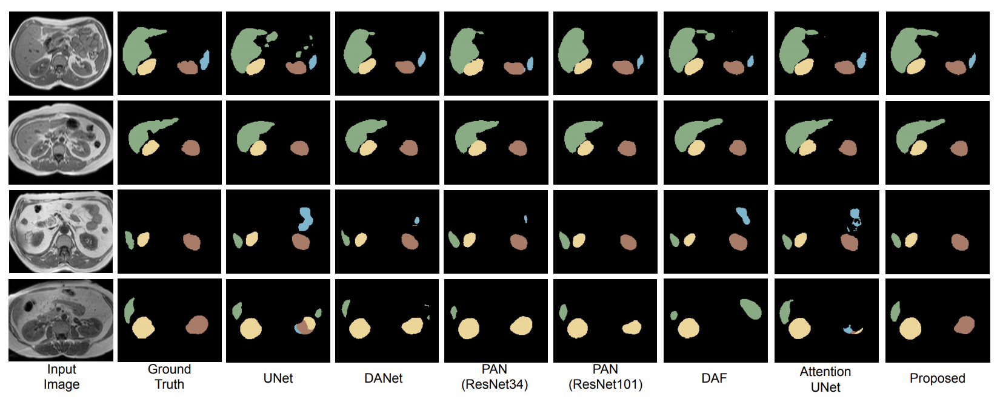

# Abdominal MRI Organ Segmentation — SwinDAF

> **Swin Transformer encoder + Dual Attention Fusion decoder for multi-organ segmentation on CHAOS MRI**


---

## Pipeline


---

## Overview

This project performs **5-class abdominal organ segmentation** on T2-SPIR MRI scans from the [CHAOS dataset](https://chaos.grand-challenge.org/). It combines a modern **Swin Transformer** vision backbone with the **Dual Attention Fusion (DAF)** decoder — featuring Position Attention, Channel Attention, and Semantic Guidance modules — to produce precise, multi-scale segmentation maps.

An interactive **Gradio dashboard** lets you upload any MRI slice and instantly see organ segmentation overlays, confidence maps, uncertainty analysis, and an AI-generated clinical report powered by **Groq LLM (Llama 3.3 70B)**.

---

## Architecture


The network is built in two stages:

```
MRI Slice (224×224)
       │
       ▼
 ┌─────────────────────────┐
 │   Swin Transformer      │  ← ImageNet pretrained encoder
 │  (swin_tiny / small /   │    4-scale feature pyramid
 │   base patch4 window7)  │    [96, 192, 384, 768] channels
 └─────────────────────────┘
       │  s1  s2  s3  s4
       ▼
 ┌─────────────────────────┐
 │  Dual Attention Fusion  │  ← Original DANet decoder
 │  ┌──────┐  ┌──────┐    │    PAM  — Position Attention Module
 │  │ PAM  │  │ CAM  │    │    CAM  — Channel Attention Module
 │  └──────┘  └──────┘    │    Semantic Guidance Module
 │      └──── Fuse ────┘  │    Multi-scale deep supervision
 └─────────────────────────┘
       │
       ▼
 Segmentation Map (5 classes)
 Background · Liver · Right Kidney · Left Kidney · Spleen
```

---

## Dashboard Features


Upload an MRI slice and get **10 visual outputs** across 4 tabs:

| Tab | What you see |
|-----|-------------|
| **Segmentation** | Colour overlay + organ boundary edges |
| **Confidence & Uncertainty** | Max-softmax confidence heatmap + Shannon entropy map |
| **Probability Maps** | Per-organ softmax probability maps + score histograms |
| **Coverage Charts** | Organ coverage bar chart + pixel distribution donut |

Plus a **statistics table** and an **LLM clinical report** generated by Groq (Llama 3.3 70B, free tier).

| Confidence Map | Probability Maps |
|:-:|:-:|
|  |  |

| Coverage Bar Chart | Pixel Donut |
|:-:|:-:|
|  |  |

**Organ colour legend:**
- Liver — Red
- Right Kidney — Green
- Left Kidney — Blue
- Spleen — Yellow

---

## Dataset


**CHAOS MRI** (Combined Healthy Abdominal Organ Segmentation)
- Modality: T2-SPIR MRI
- Task: 5-class segmentation (Background + 4 organs)
- Source: [Kaggle — CHAOS Combined CT-MR](https://www.kaggle.com/datasets/omarxadel/chaos-combined-ct-mr-healthy-abdominal-organ)

Ground truth mask encoding: pixel values 0 / 63 / 126 / 189 / 252 → classes 0–4.

Dataset split used:

| Split | Subjects | Slices |
|-------|----------|--------|
| Train | 16 | 497 |
| Val | 2 | 64 |
| Test | 2 | 62 |

---

## Project Structure

```
├── src/
│   ├── main.py                  # Training script
│   ├── demo.py                  # Gradio dashboard
│   ├── report_generator.py      # Groq LLM clinical report
│   ├── models/
│   │   ├── swin_encoder.py      # Swin Transformer wrapper (timm)
│   │   ├── swin_danet.py        # SwinDAF full model
│   │   ├── attention.py         # PAM / CAM / Semantic modules
│   │   └── my_stacked_danet.py  # Original DAF stack (ResNeXt backbone)
│   ├── data/
│   │   └── medicalDataLoader.py # CHAOS dataset loader
│   └── common/
│       └── utils.py             # Dice loss, 3D evaluation, utilities
├── DataSet/                     # CHAOS MRI slices (train/val/test)
├── model/                       # Saved checkpoints
├── app.py                       # Hugging Face Spaces entry point
├── prepare_data.py              # Download & preprocess CHAOS via kagglehub
├── upload_weights.py            # Upload checkpoint to HF Hub
├── run_demo.bat                 # Quick demo launcher (Windows)
└── requirements.txt
```

---

## How to Run This Project

### Prerequisites

| Requirement | Version |
|-------------|---------|
| Python | 3.10 or higher |
| pip | latest |
| GPU (optional) | CUDA-capable, 4 GB+ VRAM recommended for training |
| Groq API Key | Free — get one at [console.groq.com](https://console.groq.com) |

---

### Step 1 — Clone the repository

```bash
git clone https://github.com/<your-username>/Multi-Scale-Attention.git
cd Multi-Scale-Attention
```

> Replace `<your-username>` with your actual GitHub handle.

---

### Step 2 — Install dependencies

```bash
pip install -r requirements.txt
```

This installs PyTorch, timm, Gradio, Groq, and all other dependencies.

> **Windows users:** If you have multiple Python versions, use the full path:
> ```powershell
> C:\Users\<you>\AppData\Local\Programs\Python\Python313\python.exe -m pip install -r requirements.txt
> ```

---

### Step 3 — Prepare the CHAOS MRI dataset

```bash
python prepare_data.py
```

This will:
- Download the CHAOS MRI dataset automatically via `kagglehub`
- Extract T2-SPIR sequences (MRI only)
- Convert DICOM files to PNG
- Split subjects into `train` / `val` / `test`
- Save to `DataSet/train/Img`, `DataSet/train/GT`, etc.

> **Kaggle credentials required.** Make sure you have a `kaggle.json` file at `~/.kaggle/kaggle.json`.  
> Get it from: [kaggle.com](https://www.kaggle.com) → Account → Create API Token.

After running, your folder should look like:
```
DataSet/
├── train/  Img/ (497 slices)   GT/ (497 masks)
├── val/    Img/ (64 slices)    GT/ (64 masks)
└── test/   Img/ (62 slices)    GT/ (62 masks)
```

---

### Step 4 — Train the model

```bash
python src/main.py \
  --model swin_daf \
  --modelName SwinDAF-CHAOS \
  --epochs 20 \
  --batch_size 4
```

**Windows PowerShell:**
```powershell
python src/main.py --model swin_daf --modelName SwinDAF-CHAOS --epochs 20 --batch_size 4
```

The best checkpoint is automatically saved to `model/Best_SwinDAF-CHAOS.pth` whenever validation Dice improves.

Training progress is printed per batch:
```
[Training] Epoch: 0  [=====>   ] 45%  Mean Dice: 0.4231, Dice1: 0.3812, Dice2: 0.4100 ...
[val] DSC: (1): 0.412  (2): 0.389  (3): 0.401  (4): 0.445
Saving best model.....
```

**All training arguments:**

| Argument | Default | Description |
|----------|---------|-------------|
| `--model` | `daf` | `daf` (ResNeXt backbone) or `swin_daf` (Swin Transformer) |
| `--modelName` | `MS-Dual-Guided` | Name for checkpoint file and results folder |
| `--epochs` | `500` | Number of training epochs |
| `--batch_size` | `8` | Batch size (reduce to 2 if out of memory) |
| `--lr` | `0.001` | Learning rate |
| `--swin_encoder` | `swin_tiny_patch4_window7_224` | Swin variant: tiny / small / base |
| `--no_pretrain` | flag | Disable ImageNet pretrained weights |
| `--root` | `DataSet/` | Path to dataset root folder |

> **Recommended settings by hardware:**
> | GPU VRAM | batch_size | swin_encoder |
> |----------|-----------|--------------|
> | 4 GB | 2 | swin_tiny |
> | 8 GB | 4 | swin_small |
> | 16 GB+ | 8 | swin_base |

---

### Step 5 — Run the Gradio demo

**Windows (quickest):**
```bat
run_demo.bat
```

**Any OS:**
```bash
python src/demo.py --weights model/Best_SwinDAF-CHAOS.pth --port 7860
```

Then open your browser at:
```
http://127.0.0.1:7860
```

You will see the dashboard with 4 tabs. Upload any PNG from `DataSet/test/Img/` to test.

---

### Step 6 — Enable LLM clinical reports (optional)

Get a **free** Groq API key at [console.groq.com](https://console.groq.com), then:

```bash
# Linux / macOS
export GROQ_API_KEY=gsk_your_key_here
python src/demo.py --weights model/Best_SwinDAF-CHAOS.pth

# Windows PowerShell
$env:GROQ_API_KEY = "gsk_your_key_here"
python src/demo.py --weights model/Best_SwinDAF-CHAOS.pth
```

Or paste the key directly into the **"LLM Report — Groq (free)"** accordion inside the dashboard UI.

---

### Troubleshooting

| Error | Fix |
|-------|-----|
| `ModuleNotFoundError: No module named 'timm'` | Run `pip install timm>=0.9.0` |
| `CUDA out of memory` | Reduce `--batch_size` to 2 |
| `FileNotFoundError: DataSet/train/Img` | Run `python prepare_data.py` first |
| `OSError: Cannot find empty port` | Add `--port 7861` (or any free port) |
| Model loads but predicts only one organ | Train for more epochs (20+) |
| `Missing key(s) in state_dict` | Make sure `--swin_encoder` matches the checkpoint variant |

---

## Requirements

```
torch>=1.13.0
torchvision>=0.14.0
timm>=0.9.0
gradio>=4.0.0
groq>=0.9.0
huggingface_hub>=0.20.0
Pillow
scikit-image
scipy
MedPy
nibabel
dill
kagglehub
pydicom
```

---

## Results

### Qualitative Comparison vs State-of-the-Art



*Left to right: Input MRI · Ground Truth · UNet · DANet · PAN (ResNet34) · PAN (ResNeXt101) · DAF · Attention UNet · **Proposed***

### Quantitative Results (CHAOS MRI — Dice Score)

> ⏳ **Quantitative benchmarks coming soon.** Full Dice scores per organ will be published here once training on the complete CHAOS T2-SPIR set (497 slices, 20+ epochs) has finished. The Swin Transformer encoder provides strong ImageNet transfer learning, while the DAF decoder learns organ-specific attention maps for multi-scale refinement.

<!--
Drop the final per-organ scores in here once training completes, e.g.:

| Organ        | Dice Score (2D) |
|--------------|-----------------|
| Liver        | 0.xx            |
| Right Kidney | 0.xx            |
| Left Kidney  | 0.xx            |
| Spleen       | 0.xx            |
-->

---

## Deployment on Hugging Face Spaces

Set these Space secrets in your HF repo:

| Secret | Value |
|--------|-------|
| `HF_MODEL_REPO_ID` | `<your-username>/<your-model-repo>` |
| `HF_MODEL_FILENAME` | `Best_SwinDAF-CHAOS.pth` |
| `ENCODER_NAME` | `swin_tiny_patch4_window7_224` |
| `GROQ_API_KEY` | your Groq key |

Upload your trained checkpoint:

```bash
python upload_weights.py
```

---

## References

- **Original DANet paper:** Sinha, A. & Dolz, J. — *Multi-scale self-guided attention for medical image segmentation* — IEEE JBHI 2020. [arXiv](https://arxiv.org/pdf/1906.02849.pdf)
- **Swin Transformer:** Liu et al. — *Swin Transformer: Hierarchical Vision Transformer using Shifted Windows* — ICCV 2021.
- **CHAOS Dataset:** Kavur et al. — *CHAOS Challenge — Combined (CT-MR) Healthy Abdominal Organ Segmentation* — Medical Image Analysis 2021.

---

## Citation

If you use this code, please cite the original paper:

```bibtex
@article{sinha2020multi,
  title={Multi-scale self-guided attention for medical image segmentation},
  author={Sinha, A and Dolz, J},
  journal={IEEE Journal of Biomedical and Health Informatics},
  year={2020}
}
```

---

*Built with PyTorch · timm · Gradio · Groq · Hugging Face*
