# Abdominal MRI Organ Segmentation — SwinDAF

> **Swin Transformer encoder + Dual Attention Fusion decoder for multi-organ segmentation on CHAOS MRI**

[](https://github.com/Mounish-Allam/Abdominal-Vision-Transformers/actions/workflows/ci.yml)


> ⚠️ **Research and education demo. Not a medical device. Not for diagnostic use.**

| | |
|---|---|
| **Live demo** | [huggingface.co/spaces/MounishAllam/swin-daf-chaos-mri](https://huggingface.co/spaces/MounishAllam/swin-daf-chaos-mri) |
| **Trained weights** | [`MounishAllam/swin-daf-chaos-mri`](https://huggingface.co/MounishAllam/swin-daf-chaos-mri) on HF Hub |
| **Dataset** | [CHAOS](https://chaos.grand-challenge.org/) T2-SPIR MRI, 20 subjects, subject-level 16/2/2 split |
| **Cost** | **$0 cloud/API cost** — free-tier Groq LLM, local sentence-transformers embeddings; training itself used a local RTX 5080 (not free hardware, just not a cloud bill) |
| **Test-set result** | SwinDAF 0.762 mean Dice (2D) vs. 0.702 DAF baseline — see [Results](#results) for the full breakdown, including a disclosed failure case |
| **RAG grounding** | Cuts unsupported-claim rate 1.3% → 0.6%, raises uncertainty-flagging 28% → 100% — see [Report grounding evaluation](#report-grounding-evaluation-rag-beforeafter) |

---

## Pipeline

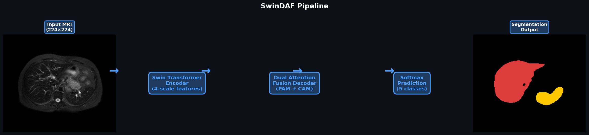

---

## Overview

This project performs **5-class abdominal organ segmentation** on T2-SPIR MRI scans from the [CHAOS dataset](https://chaos.grand-challenge.org/). It combines a modern **Swin Transformer** vision backbone with the **Dual Attention Fusion (DAF)** decoder — featuring Position Attention, Channel Attention, and Semantic Guidance modules — to produce precise, multi-scale segmentation maps.

An interactive **Gradio dashboard** lets you upload any MRI slice and instantly see organ segmentation overlays, confidence maps, uncertainty analysis, and an AI-generated clinical report powered by a swappable LLM backend (**Groq Llama 3.3 70B** by default; a fully local/private **Ollama Qwen3-8B** path is also supported — see [Step 6](#step-6--enable-llm-clinical-reports-optional)).

---

## Architecture

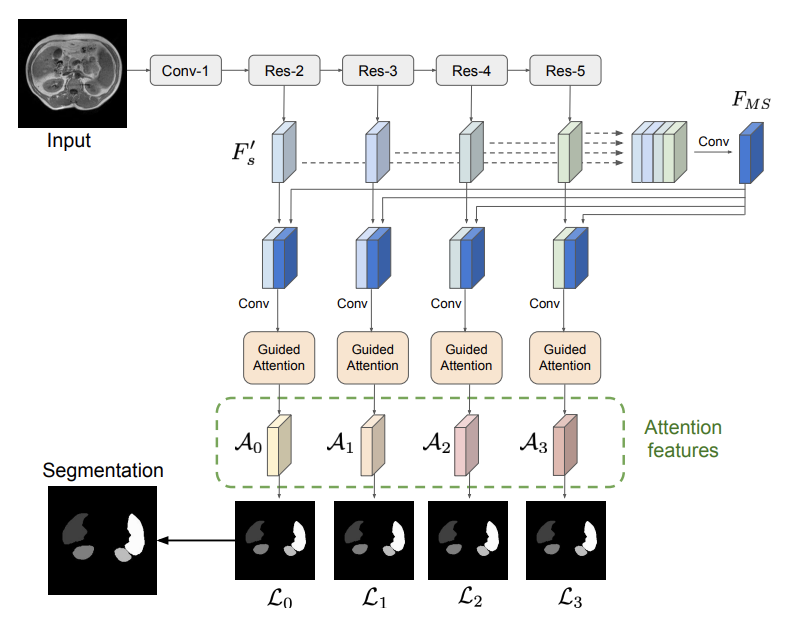

The network is built in two stages:

```
MRI Slice (224×224)
       │
       ▼
 ┌─────────────────────────┐
 │   Swin Transformer      │  ← ImageNet pretrained encoder
 │  (swin_tiny / small /   │    4-scale feature pyramid
 │   base patch4 window7)  │    [96, 192, 384, 768] channels
 └─────────────────────────┘
       │  s1  s2  s3  s4
       ▼
 ┌─────────────────────────┐
 │  Dual Attention Fusion  │  ← Original DANet decoder
 │  ┌──────┐  ┌──────┐    │    PAM  — Position Attention Module
 │  │ PAM  │  │ CAM  │    │    CAM  — Channel Attention Module
 │  └──────┘  └──────┘    │    Semantic Guidance Module
 │      └──── Fuse ────┘  │    Multi-scale deep supervision
 └─────────────────────────┘
       │
       ▼
 Segmentation Map (5 classes)
 Background · Liver · Right Kidney · Left Kidney · Spleen
```

---

## Dashboard Features

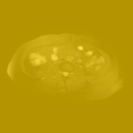

Upload an MRI slice and get **10 visual outputs** across 4 tabs:

| Tab | What you see |
|-----|-------------|
| **Segmentation** | Colour overlay + organ boundary edges |
| **Confidence & Uncertainty** | Max-softmax confidence heatmap + Shannon entropy map |
| **Probability Maps** | Per-organ softmax probability maps + score histograms |
| **Coverage Charts** | Organ coverage bar chart + pixel distribution donut |

Plus a **statistics table** and an **LLM clinical report** (Groq Llama 3.3 70B by default, free tier; swappable to a local Ollama Qwen3-8B).

| Confidence Map | Probability Maps |
|:-:|:-:|
| 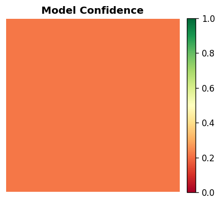 | 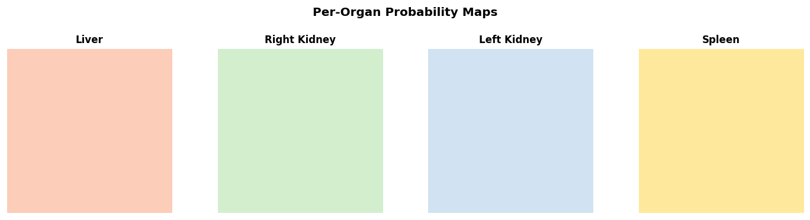 |

| Coverage Bar Chart | Pixel Donut |
|:-:|:-:|
| 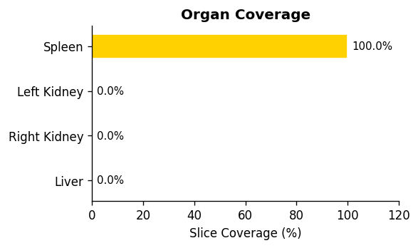 | 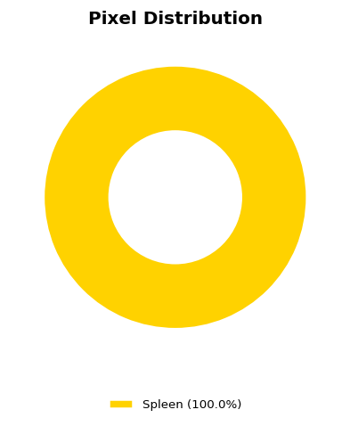 |

**Organ colour legend:**
- Liver — Red
- Right Kidney — Green
- Left Kidney — Blue
- Spleen — Yellow

### RAG-grounded clinical report

The LLM report can be grounded in retrieved reference passages (toggle in the UI, on by
default) instead of improvising from the segmentation stats alone. The grounded report is
structured as `Findings:` / `Impression:` sections, ends with a `References` list naming
the exact passages used, and the passages themselves are shown in an expandable accordion
so nothing is a black box:

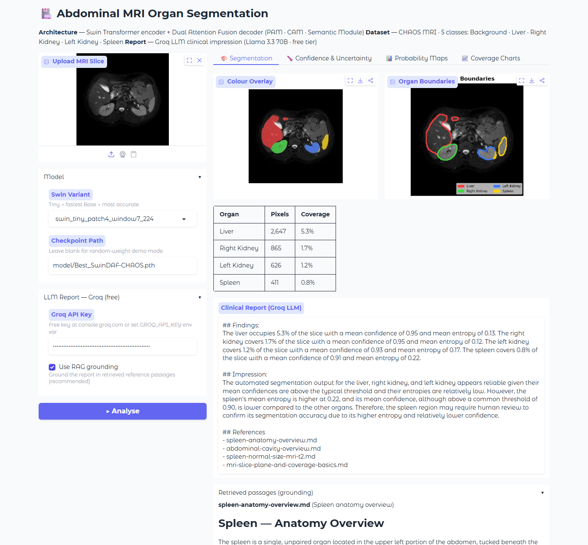

See [Report grounding evaluation](#report-grounding-evaluation-rag-beforeafter) below for
real before/after numbers on whether this grounding actually helps.

---

## Dataset

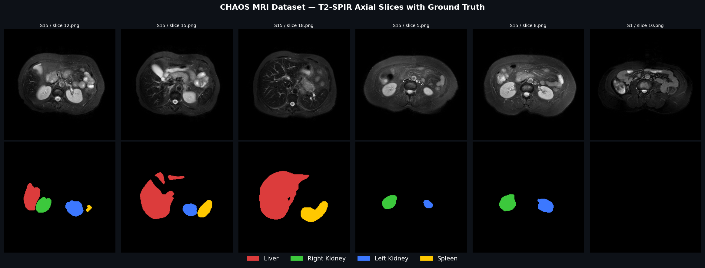

**CHAOS MRI** (Combined Healthy Abdominal Organ Segmentation)
- Modality: T2-SPIR MRI
- Task: 5-class segmentation (Background + 4 organs)
- Source: [Kaggle — CHAOS Combined CT-MR](https://www.kaggle.com/datasets/omarxadel/chaos-combined-ct-mr-healthy-abdominal-organ)

Ground truth mask encoding: pixel values 0 / 63 / 126 / 189 / 252 → classes 0–4.

Dataset split used:

| Split | Subjects | Slices |
|-------|----------|--------|
| Train | 16 | 497 |
| Val | 2 | 64 |
| Test | 2 | 62 |

---

## Project Structure

```
├── src/
│   ├── main.py                  # Training script
│   ├── demo.py                  # Gradio dashboard
│   ├── report_generator.py      # Clinical report generation (grounded + legacy)
│   ├── llm/
│   │   └── provider.py          # LLM client selection: Groq / Ollama / OpenAI-compatible
│   ├── models/
│   │   ├── swin_encoder.py      # Swin Transformer wrapper (timm)
│   │   ├── swin_danet.py        # SwinDAF full model
│   │   ├── attention.py         # PAM / CAM / Semantic modules
│   │   └── my_stacked_danet.py  # Original DAF stack (ResNeXt backbone)
│   ├── data/
│   │   └── medicalDataLoader.py # CHAOS dataset loader
│   └── common/
│       └── utils.py             # Dice loss, 3D evaluation, utilities
├── rag/
│   ├── build_index.py           # Builds the FAISS knowledge-base index
│   ├── retrieval.py             # Query building + similarity search
│   ├── eval_reports.py          # Generates before/after RAG report sets for scoring
│   ├── auto_score_claims.py     # Rule-based unsupported-claim cross-check
│   ├── tally_scores.py          # Aggregates the before/after RAG evaluation table
│   └── kb_index/                # Committed FAISS index (built from knowledge_base/)
├── knowledge_base/              # Reference markdown docs used for RAG grounding
├── scripts/
│   ├── make_results_table.py    # Regenerates the README Results tables from outputs/*.json
│   └── make_qualitative_examples.py  # Generates real best/median/worst overlay images
├── tests/                       # pytest suite (model + RAG + report logic, all mocked/CPU, no GPU/network)
├── examples/                    # Bundled test-split slices for the HF Space's one-click demo
├── DataSet/                     # CHAOS MRI slices (train/val/test) — gitignored, from prepare_data.py
├── model/                       # Saved checkpoints — .pth gitignored, download via HF Hub
├── outputs/                     # Metrics JSONs, qualitative images, analytics.db (tracked — the evaluation paper trail)
├── app.py                       # Hugging Face Spaces entry point
├── analytics.py                 # SQLite logging for evaluate.py + demo.py inferences
├── queries.sql                  # Documented SQL queries over outputs/analytics.db
├── evaluate.py                  # Test-set Dice evaluation (2D + 3D per-subject)
├── prepare_data.py              # Download & preprocess CHAOS via kagglehub
├── upload_weights.py            # Upload checkpoint + model card to HF Hub
├── model_card.md                # HF Hub model card source
├── run_demo.bat                 # Quick demo launcher (Windows)
└── requirements.txt
```

---

## How to Run This Project

### Prerequisites

| Requirement | Version |
|-------------|---------|
| Python | **3.11 recommended.** Very new interpreters (3.13+) may lack prebuilt wheels for some pinned dependencies, forcing slow/failing source builds — see Troubleshooting below. |
| pip | latest |
| GPU (optional) | CUDA-capable, 4 GB+ VRAM recommended for training |
| Groq API Key | Free — get one at [console.groq.com](https://console.groq.com) (only needed for the default LLM provider — see [Step 6](#step-6--enable-llm-clinical-reports-optional)) |

---

### Step 1 — Clone the repository

```bash
git clone https://github.com/Mounish-Allam/Abdominal-Vision-Transformers.git
cd Abdominal-Vision-Transformers
```

---

### Step 2 — Install dependencies

```bash
pip install -r requirements.txt
```

This installs PyTorch, timm, Gradio, Groq, and all other dependencies.

> **Windows users:** If you have multiple Python versions, use the full path:
> ```powershell
> C:\Users\<you>\AppData\Local\Programs\Python\Python311\python.exe -m pip install -r requirements.txt
> ```

---

### Step 3 — Prepare the CHAOS MRI dataset

```bash
python prepare_data.py
```

This will:
- Download the CHAOS MRI dataset automatically via `kagglehub`
- Extract T2-SPIR sequences (MRI only)
- Convert DICOM files to PNG
- Split subjects into `train` / `val` / `test`
- Save to `DataSet/train/Img`, `DataSet/train/GT`, etc.

> **Kaggle credentials required.** Make sure you have a `kaggle.json` file at `~/.kaggle/kaggle.json`.  
> Get it from: [kaggle.com](https://www.kaggle.com) → Account → Create API Token.

After running, your folder should look like:
```
DataSet/
├── train/  Img/ (497 slices)   GT/ (497 masks)
├── val/    Img/ (64 slices)    GT/ (64 masks)
└── test/   Img/ (62 slices)    GT/ (62 masks)
```

---

### Step 4 — Train the model

These are the exact settings used to produce the numbers in the [Results](#results) section
below (RTX 5080, 16 GB VRAM; reduce `--batch_size` if you have less):

```bash
# Main model (SwinDAF)
python src/main.py --model swin_daf --modelName SwinDAF-CHAOS \
  --swin_encoder swin_tiny_patch4_window7_224 --epochs 30 --batch_size 16

# Baseline for comparison (original DAF, ResNeXt-101 backbone)
python src/main.py --model daf --modelName DAF-baseline --epochs 30 --batch_size 8
```

**Windows PowerShell:** same commands, one line each (no `\` line continuation).

The best checkpoint is automatically saved to `model/Best_<modelName>.pth` whenever validation
Dice improves. For a quick smoke test instead of the full ~1 hour run, drop `--epochs` down
(e.g. `--epochs 5`) — the checkpoint just won't match the published Dice numbers.

Training progress is printed per batch:
```
[Training] Epoch: 0  [=====>   ] 45%  Mean Dice: 0.4231, Dice1: 0.3812, Dice2: 0.4100 ...
[val] DSC: (1): 0.412  (2): 0.389  (3): 0.401  (4): 0.445
Saving best model.....
```

**All training arguments:**

| Argument | Default | Description |
|----------|---------|-------------|
| `--model` | `daf` | `daf` (ResNeXt backbone) or `swin_daf` (Swin Transformer) |
| `--modelName` | `MS-Dual-Guided` | Name for checkpoint file and results folder |
| `--epochs` | `500` | Number of training epochs |
| `--batch_size` | `8` | Batch size (reduce to 2 if out of memory) |
| `--lr` | `0.001` | Learning rate |
| `--swin_encoder` | `swin_tiny_patch4_window7_224` | Swin variant: tiny / small / base |
| `--no_pretrain` | flag | Disable ImageNet pretrained weights |
| `--root` | `DataSet/` | Path to dataset root folder |

> **Recommended settings by hardware:**
> | GPU VRAM | batch_size | swin_encoder |
> |----------|-----------|--------------|
> | 4 GB | 2 | swin_tiny |
> | 8 GB | 4 | swin_small |
> | 16 GB+ | 8 | swin_base |

---

### Step 5 — Run the Gradio demo

**Windows (quickest):**
```bat
run_demo.bat
```

**Any OS:**
```bash
python src/demo.py --weights model/Best_SwinDAF-CHAOS.pth --port 7860
```

Then open your browser at:
```
http://127.0.0.1:7860
```

You will see the dashboard with 4 tabs. Upload any PNG from `DataSet/test/Img/` to test.

---

### Step 6 — Enable LLM clinical reports (optional)

The report LLM is provider-agnostic — `src/llm/provider.py` selects the client via an
`LLM_PROVIDER` env var, so no code changes are needed to switch backends:

| Provider | Cost | Privacy | Setup |
|---|---|---|---|
| **Groq** (default) | Free tier, hosted | Data leaves the machine | Free key at [console.groq.com](https://console.groq.com) |
| **Ollama** | Free, local | Fully on-prem, no data egress | `ollama pull qwen3:8b`, run Ollama locally |
| **Any OpenAI-compatible endpoint** (e.g. vLLM) | Depends | Depends | Point at your own server |

```bash
# Groq (default) — Linux/macOS
export GROQ_API_KEY=gsk_your_key_here
python src/demo.py --weights model/Best_SwinDAF-CHAOS.pth

# Groq (default) — Windows PowerShell
$env:GROQ_API_KEY = "gsk_your_key_here"
python src/demo.py --weights model/Best_SwinDAF-CHAOS.pth

# Ollama — local, private, no API key (after `ollama pull qwen3:8b`)
LLM_PROVIDER=ollama LLM_MODEL=qwen3:8b python src/demo.py --weights model/Best_SwinDAF-CHAOS.pth

# Any OpenAI-compatible endpoint
LLM_PROVIDER=openai_compatible LLM_BASE_URL=http://host:port/v1 LLM_MODEL=your-model \
    python src/demo.py --weights model/Best_SwinDAF-CHAOS.pth
```

Or paste a Groq key directly into the **"LLM Report"** accordion inside the dashboard UI (only
used when `LLM_PROVIDER=groq`, the default). Swapping providers changes report *prose* only —
it has no effect on segmentation Dice, which comes from the Swin+DAF network alone.

---

### Troubleshooting

| Error | Fix |
|-------|-----|
| `ModuleNotFoundError: No module named 'timm'` | Run `pip install timm>=0.9.0` |
| `CUDA out of memory` | Reduce `--batch_size` to 2 |
| `FileNotFoundError: DataSet/train/Img` | Run `python prepare_data.py` first |
| `OSError: Cannot find empty port` | Add `--port 7861` (or any free port) |
| Model loads but predicts only one organ | Train for more epochs (20+) |
| `Missing key(s) in state_dict` | Make sure `--swin_encoder` matches the checkpoint variant |
| `pip install` fails building a package from source (e.g. `tokenizers`) | Use Python 3.11 — very new interpreters may not have prebuilt wheels yet for some pinned versions |

---

## Requirements

All dependencies are pinned to exact, verified-working versions in
[`requirements.txt`](requirements.txt) — that file (not this README) is the source of truth,
so it never drifts out of sync as dependencies are added. Broadly: PyTorch/timm/Gradio for the
model and dashboard, and the LangChain family + `sentence-transformers` + `faiss-cpu` for the
RAG grounding layer. `torch`/`torchvision` are the one exception, kept as a minimum-version
floor since the right build (CPU vs. a specific CUDA version) depends on the machine.

```bash
pip install -r requirements.txt
```

---

## Results

Both models below were trained **locally on an RTX 5080** with fixed settings
(30 epochs, best-validation-Dice checkpoint selection, bf16 AMP,
seed 42) and evaluated with `evaluate.py` on the **held-out test split** (2 subjects,
62 slices) that the model never saw during training or validation. Every number below is
regenerated by [`scripts/make_results_table.py`](scripts/make_results_table.py) from the
raw JSONs in [`outputs/`](outputs/) — nothing here is hand-typed.

### Test-set Dice score (2D per-slice, mean ± std)

| Organ | DAF baseline (ResNeXt-101) | SwinDAF (Swin-Tiny + DAF) |
|---|---|---|
| Liver | 0.565 ± 0.462 | 0.689 ± 0.428 |
| Right Kidney | 0.799 ± 0.341 | 0.812 ± 0.348 |
| Left Kidney | 0.738 ± 0.384 | 0.816 ± 0.342 |
| Spleen | 0.706 ± 0.421 | 0.731 ± 0.403 |
| **Mean** | **0.702** | **0.762** |

### Test-set Dice score (3D per-subject, mean ± std)

| Organ | DAF baseline (ResNeXt-101) | SwinDAF (Swin-Tiny + DAF) |
|---|---|---|
| Liver | 0.484 ± 0.440 | 0.479 ± 0.465 |
| Right Kidney | 0.777 ± 0.127 | 0.910 ± 0.017 |
| Left Kidney | 0.743 ± 0.070 | 0.898 ± 0.014 |
| Spleen | 0.353 ± 0.353 | 0.393 ± 0.393 |
| **Mean** | **0.589** | **0.670** |

*3D scores computed per-subject over 2 held-out test subjects — see the failure analysis
below for why that small `n` matters.*

**Reproduce these numbers from a fresh clone:**
```bash
python evaluate.py --weights model/Best_SwinDAF-CHAOS.pth --model swin_daf --split test
python evaluate.py --weights model/Best_DAF-baseline.pth  --model daf      --split test
python scripts/make_results_table.py
```
Raw metrics: `outputs/test_metrics_swin_daf_*.json`, `outputs/test_metrics_daf_*.json`.

**Trained weights:** [`MounishAllam/swin-daf-chaos-mri`](https://huggingface.co/MounishAllam/swin-daf-chaos-mri) on the Hugging Face Hub.

### Organ performance at a glance (SwinDAF, best → worst)

| Rank | 2D per-slice Dice | 3D volumetric Dice |
|---|---|---|
| 1 (best) | Left Kidney — 0.816 | Right Kidney — 0.910 |
| 2 | Right Kidney — 0.812 | Left Kidney — 0.898 |
| 3 | Spleen — 0.731 | Liver — 0.479 |
| 4 (worst) | Liver — 0.689 | Spleen — 0.393 |

**The ranking flips between metrics, and that flip is the real finding.** Both kidneys are
reliably strong on either metric — no caveats needed there. Liver and Spleen look like ordinary
"third and fourth place, still respectable" scores on the 2D metric, but collapse to the two
worst-performing organs by a wide margin once measured in 3D. That's not two separate findings;
it's the same Subject 15 failure (see [Failure analysis](#failure-analysis) below) hidden by the
2D metric's tendency to average in slices where an organ is correctly predicted as absent. The
3D number is the one to trust for "how good is this model at segmenting the liver," since it
scores the whole reconstructed organ once instead of slice-by-slice.

The qualitative panel below shows exactly what this looks like: the "Best slice" example is 0.99
mean Dice on Subject 1; the "Worst slice" example is Subject 15, slice 16, where the model
predicts no Liver or Spleen pixels at all — a direct picture of the 3D-Dice-0.014/0.000 failure
in the table above.

### Qualitative Examples (real SwinDAF checkpoint, real test slices)

Each panel is **Input MRI · Ground Truth overlay · Prediction overlay** (🔴 Liver · 🟢 Right
Kidney · 🔵 Left Kidney · 🟡 Spleen), generated by
[`scripts/make_qualitative_examples.py`](scripts/make_qualitative_examples.py) — not cherry-picked
from a paper. 12 of the 62 test slices have no organs in the ground truth at all (edge
slices); those are excluded from this selection since an empty slice trivially scores a
"perfect" Dice by predicting nothing, which isn't a meaningful demonstration.

| Best slice (mean Dice 0.99) | Median slice (mean Dice 0.82) | Worst slice (mean Dice 0.00) |
|:-:|:-:|:-:|
| 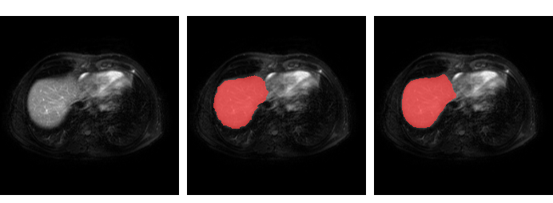 | 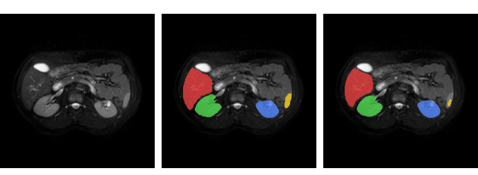 | 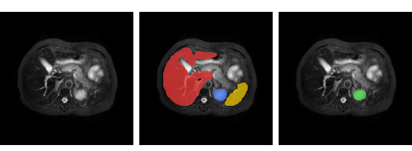 |

### Failure analysis

Per-subject breakdown on the test split (SwinDAF):

| Subject | Slices | Metric | Liver | Right Kidney | Left Kidney | Spleen |
|---|---|---|---|---|---|---|
| Subject 1  | 36 | 2D mean Dice | 0.923 | 0.854 | 0.791 | 0.870 |
| Subject 15 | 26 | 2D mean Dice | 0.365 | 0.755 | 0.852 | 0.539 |
| Subject 1  | 36 | 3D volumetric Dice | 0.944 | 0.927 | 0.884 | 0.786 |
| Subject 15 | 26 | 3D volumetric Dice | 0.014 | 0.893 | 0.911 | 0.000 |

The aggregate "mean Dice" hides a bigger and more specific problem than the usual
"small organs are harder than large ones" story. **The failure is concentrated almost
entirely in one test subject, and it is worse than the 2D-per-slice metric alone suggests.**
2D per-slice Dice averages in a lot of slices where the organ isn't present at all and the
model correctly predicts nothing there, which inflates the score. The 3D volumetric Dice
(computed once over the whole reconstructed organ, not slice-by-slice) is the honest number:
on Subject 15, the model predicts essentially **zero spleen pixels across all 26 slices**
(3D Dice 0.000) and misses the liver almost entirely (3D Dice 0.014, vs. 0.944 on Subject 1)
— visible directly in the "worst" example above (Subject 15, slice 16, mean Dice 0.00), where
the model predicts no Liver or Spleen at all. Both subjects score well on the kidneys at both
metrics.

**An intensity-jitter fix was tried and did not help.** Subject 15's images run measurably
brighter than the training-set mean, so brightness/contrast jitter (`PIL.ImageEnhance`,
factor range 0.85–1.15, image-only, geometric augmentations unchanged) was added to training
as a hypothesis fix and the model was fully retrained (30 epochs, same fixed seed/settings).
Re-evaluated on the same held-out test split, Subject 15's numbers were statistically
unchanged: 2D Liver 0.317 → 0.365, 2D Spleen 0.539 → 0.539, and the 3D volumetric numbers
(newly measured this round) are similarly severe either way. In other words, the failure was
already this bad at the volumetric level before the fix was tried — the 2D-averaged metric
originally reported here was simply making it look less catastrophic than it is. Since the
jitter produced no measurable improvement, the code change was reverted to avoid unjustified
complexity; the checkpoint trained with it was kept since it performs equivalently to the
original (2D mean Dice 0.762 vs. 0.772 aggregate, well within run-to-run noise).

With only **2 held-out test subjects** (a deliberate consequence of a subject-level
16/2/2 split — CHAOS is never split at the slice level, since adjacent slices from one
patient would leak), a single atypical scan can
swing the entire test-set mean. This is a real limitation of evaluating on 20 total CHAOS
subjects, not evidence that kidneys are inherently easier than the liver. Since intensity
jitter specifically didn't move the numbers, more likely contributors are (a) anatomical
variation in Subject 15's liver/spleen presentation that's out-of-distribution relative to
the 16-subject training set in ways jitter doesn't address, or (b) the small training set
giving the encoder too little variety to generalize from at all for this subject.

**What would move the numbers next:** more CHAOS training subjects (the highest-leverage
fix, given jitter alone didn't work), anatomical/spatial augmentation beyond intensity
(elastic deformation, organ-presence-aware sampling), test-time augmentation, or ensembling —
documented honestly here rather than reporting only the more favorable subject.

---

## Report grounding evaluation (RAG, before/after)

Does grounding the LLM report in retrieved reference passages actually help? Reports were
generated in both modes (legacy/ungrounded vs. RAG-grounded) for the same 30 fixed,
seeded test slices (seed 42, listed in `outputs/reports_*.json`), then scored:

| Metric | No-RAG (legacy) | RAG-grounded | Delta |
|---|---|---|---|
| Structure adherence (Findings:/Impression: present) | 100.0% | 100.0% | +0.0pp |
| Uncertainty-flagging rate (when any organ needed review) | 28.0% | 100.0% | +72.0pp |
| Reference usage (≥ 1 passage cited) | N/A | 100.0% | — |
| Unsupported-claim rate (328 sentences reviewed) | 1.3% (2/153) | 0.6% (1/175) | −0.7pp |

**Scoring methodology note:** the unsupported-claim rate above was scored by an automated,
rule-based cross-check (`rag/auto_score_claims.py`) — it extracts every number a sentence
states and checks it against the slice's real measurements, not by independent human
clinical review. This is a self-consistency check, not a validated accuracy measure. One
row was manually corrected after spot-checking (see below) because the automated check
missed a specific class of error: it confirms a stated number is *real somewhere in the
slice's data*, but not that it's attached to the *right organ*.

**Where RAG helped:** on `Subj_1slice_29` (no kidneys visible in this slice), the legacy
report hedged loosely — *"the asymmetry in kidney visibility is notable... further imaging
would be necessary"* — without ever flagging *which* organ's segmentation was actually
uncertain. The RAG report used the same measurements plus a retrieved passage on organ
confidence, and named the specific issue: *"The spleen's segmentation... shows higher
entropy, suggesting that this region may require human review to confirm the accuracy."*
Across all 30 slices, RAG explicitly flagged uncertainty every time an organ needed it
(100%); legacy did so only 28% of the time.

**Where RAG didn't help:** on `Subj_1slice_22`, the RAG report correctly stated the spleen's
real confidence (0.91) and entropy (0.22) — then added *"as its confidence is below the
threshold of 0.93"*. There is no 0.93 threshold anywhere in this project (the real
threshold is 0.5); the model invented one. Grounding reduced this kind of error (0.6% vs.
1.3% of sentences) but didn't eliminate it — retrieval doesn't stop a model from adding
a plausible-sounding, specific-but-fabricated number on top of real ones.

<details>
<summary>Regenerate this table</summary>

```bash
python rag/eval_reports.py --n 30 --seed 42
python rag/auto_score_claims.py   # or fill outputs/claim_scoring_sheet.csv by hand
python rag/tally_scores.py
```

</details>

---

## SQL analytics

`analytics.py` logs every inference to a local SQLite database (`outputs/analytics.db`,
stdlib `sqlite3` only, no extra dependency): one row per slice in `inferences`, one row per
organ per slice in `organ_stats` (pixel coverage, confidence, entropy, the low-confidence
flag, and Dice whenever ground truth is available). `evaluate.py` logs every test-set slice
with real Dice scores; `src/demo.py` logs every live dashboard inference (no Dice, since
user-uploaded slices have no ground truth) best-effort, so a logging failure never breaks the
UI. Documented queries live in [`queries.sql`](queries.sql).

**Example: does the SQL aggregate match the JSON-derived results table above?**
```sql
SELECT i.model_name, o.organ, ROUND(AVG(o.dice), 4), COUNT(*)
FROM organ_stats o JOIN inferences i ON i.id = o.inference_id
WHERE i.source = 'evaluate' AND o.dice IS NOT NULL
GROUP BY i.model_name, o.organ ORDER BY i.model_name, 3 DESC;
```
```
daf       | Right Kidney | 0.7987 | 62
daf       | Left Kidney  | 0.7383 | 62
daf       | Spleen       | 0.7056 | 62
daf       | Liver        | 0.5652 | 62
swin_daf  | Left Kidney  | 0.8162 | 62
swin_daf  | Right Kidney | 0.8122 | 62
swin_daf  | Spleen       | 0.7309 | 62
swin_daf  | Liver        | 0.6891 | 62
```
Yes — matches the [2D Dice table](#test-set-dice-score-2d-per-slice-mean--std) above exactly,
computed independently from raw per-slice rows instead of the pre-aggregated JSON.

**Example: how often does SwinDAF flag a region for human review, per organ?**
```sql
SELECT o.organ, SUM(o.low_confidence), COUNT(*),
       ROUND(100.0 * SUM(o.low_confidence) / COUNT(*), 1)
FROM organ_stats o JOIN inferences i ON i.id = o.inference_id
WHERE i.model_name = 'swin_daf'
GROUP BY o.organ ORDER BY 4 DESC;
```
```
Right Kidney | 2 | 62 | 3.2%
Left Kidney  | 1 | 62 | 1.6%
Liver        | 0 | 62 | 0.0%
Spleen       | 0 | 62 | 0.0%
```
Worth noting: this is the opposite of what the Dice numbers alone would suggest — the model
is *most* confident on Liver despite Liver having the worst 3D Dice score, because low
confidence and low Dice measure different failure modes (the model can be wrong while
"confident," which is exactly why grounding a clinical report in confidence scores alone,
without RAG's uncertainty language, isn't sufficient - see
[Report grounding evaluation](#report-grounding-evaluation-rag-beforeafter) above).

**Reproduce this database from a fresh clone:**
```bash
python evaluate.py --weights model/Best_SwinDAF-CHAOS.pth --model swin_daf --split test
python evaluate.py --weights model/Best_DAF-baseline.pth  --model daf      --split test
sqlite3 outputs/analytics.db < queries.sql
```

---

## Deployment on Hugging Face Spaces

`app.py` is the Space entry point: on cold start it downloads the checkpoint from the HF
model repo via Space secrets, loads the committed `rag/kb_index/` FAISS index, and serves the
full Gradio dashboard (segmentation, confidence/uncertainty, RAG-grounded report). Five
bundled example slices from the held-out test split (`examples/`) let visitors try it with
zero setup — one is deliberately the disclosed worst-case failure slice, not just the best
one. CPU inference for a single 224×224 slice measured ~0.18s locally, well within the free
CPU tier's tolerance — no precomputation fallback needed.

Set these Space secrets in your HF repo:

| Secret | Value |
|--------|-------|
| `HF_MODEL_REPO_ID` | `MounishAllam/swin-daf-chaos-mri` |
| `HF_MODEL_FILENAME` | `Best_SwinDAF-CHAOS.pth` |
| `ENCODER_NAME` | `swin_tiny_patch4_window7_224` |
| `GROQ_API_KEY` | your Groq key |

Upload your trained checkpoint and model card:

```bash
python upload_weights.py --weights model/Best_SwinDAF-CHAOS.pth --repo MounishAllam/swin-daf-chaos-mri
```

---

## Limitations

- **Not a medical device, not for diagnostic use** — see the disclaimer at the top of this
  README and in the app's footer. Outputs are for research/education only.
- **Small test set (2 subjects, 62 slices)**, a deliberate consequence of never splitting
  CHAOS at the slice level. This makes the aggregate mean sensitive to a
  single atypical subject — see [Failure analysis](#failure-analysis) for the real, disclosed case.
- **The LLM-generated clinical report is decision-support text, not a medical finding.**
  Even with RAG grounding, it can still state details not supported by the measurements or
  retrieved passages (measured unsupported-claim rate: 0.6% with RAG, 1.3% without) — see
  [Report grounding evaluation](#report-grounding-evaluation-rag-beforeafter) for the honest
  numbers and named examples of both a case where grounding helped and one where it didn't.
- **Trained on a single public dataset (CHAOS, 20 subjects total).** Generalization to other
  scanners, protocols, or patient populations is untested.
- **RAG evaluation scoring is AI-assisted, not independent human clinical review** — see the
  methodology caveat in the evaluation section for what that does and doesn't validate.

## References

- **Original DANet paper:** Sinha, A. & Dolz, J. — *Multi-scale self-guided attention for medical image segmentation* — IEEE JBHI 2020. [arXiv](https://arxiv.org/pdf/1906.02849.pdf)
- **Swin Transformer:** Liu et al. — *Swin Transformer: Hierarchical Vision Transformer using Shifted Windows* — ICCV 2021.
- **CHAOS Dataset:** Kavur et al. — *CHAOS Challenge — Combined (CT-MR) Healthy Abdominal Organ Segmentation* — Medical Image Analysis 2021.

---

## Citation

If you use this code, please cite the original paper:

```bibtex
@article{sinha2020multi,
  title={Multi-scale self-guided attention for medical image segmentation},
  author={Sinha, A and Dolz, J},
  journal={IEEE Journal of Biomedical and Health Informatics},
  year={2020}
}
```

---

*Built with PyTorch · timm · Gradio · Groq · Hugging Face*
